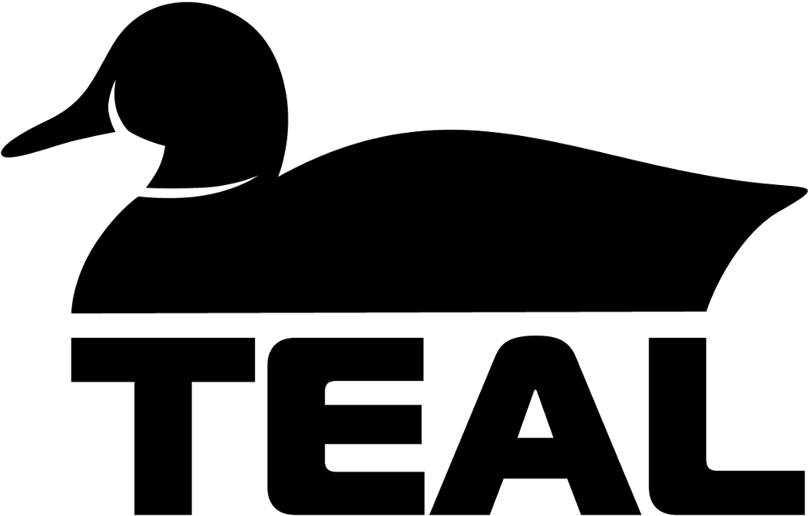

TEAL (Tool for Economic AnaLysis) is RAVEN plugin aimed to
contain and deploy economic analysis for RAVEN workflows.

It leverages the Uncertanty Quantification, Probabilistic Risk Assesment, 
Parameter Optimizzation and Data Anlysis framework  [RAVEN](https://github.com/idaholab/raven)
to deploy complex economic analyses.

TEAL enables the capability to compute the NPV (Net Present Value), 
IRR (Internal Rate of Return) and the PI (Profitability Index) with RAVEN. 
Furthermore, it allows NPV, IRR or PI search, i.e. TEAL will compute a 
multiplicative value (for example the production cost) so that the NPV, IRR or PI has 
a desired value. 
The plugin allows for a generic definition of cash flows, which 
drivers are provided by RAVEN. Furthermore, TEAL includes flexible options to
deal with taxes, inflation, discounting and offers  capabilities to compute
a combined cash flow for components with different component lives.

Instructions for installing RAVEN plugins (including TEAL) 
can be found [on RAVEN's website](https://github.com/idaholab/raven/wiki/Plugins).   

 
